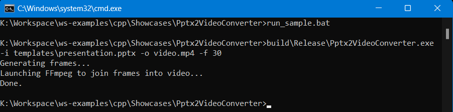
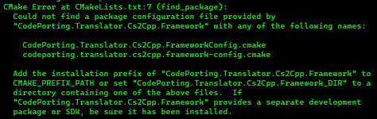

# Pptx2VideoConverter Demo

Pptx2VideoConverter allows to open presentations in PPT, PPTX, ODP formats using **Aspose.Slides for C++**, generate frames of animations with specified FPS (frames per second) and join frames into MP4 video.



# Prerequisites

Make sure that you have installed FFmpeg 2.8+ and path to `ffmpeg` or `ffmpeg.exe` specified in `PATH` environment variable. If not, please add it:
   Windows:
   ```bat
   set PATH=<path\to\ffmpeg\exe>;%PATH%
   ```

   Linux/MacOS:
   ```sh
   export PATH="<path/to/ffmpeg>:$PATH"
   ```

## How to build Pptx2VideoConverter

To build PresentationExplorer on your computer you will need these packages:
- CMake 3.5+ (https://cmake.org/)
- Aspose.Slides for C++ (https://downloads.aspose.com/slides/cpp)

### Build using scripts

1) Set environment variable `ASPOSE_SLIDES_CPP_PATH` with path where Aspose.Slides for C++ ZIP-archive was unpacked, e.g. `d:\aspose-slides-cpp-23.1` on Windows or `/home/user/aspose-slides-cpp-23.1` on Linux/MacOS:
   
   - Windows:
   ```bat
   set ASPOSE_SLIDES_CPP_PATH=d:\aspose-slides-cpp-23.1
   ```

   - Linux/MacOS:
   ```sh
   export ASPOSE_SLIDES_CPP_PATH=/home/user/aspose-slides-cpp-23.1
   ```

2) Run `build_sample.bat` on Windows or `./build_sample.sh` on Linux/MacOS. If environment variable `ASPOSE_SLIDES_CPP_PATH` doesn't set to Aspose.Slides for C++, appropriate message will be shown (about `CodePorting.Translator.Cs2Cpp.Framework` or `Aspose.Slides.Cpp`)



### Build on Linux/MacOS

1) Set environment variable `ASPOSE_SLIDES_CPP_PATH` with path where Aspose.Slides for C++ ZIP-archive was unpacked, e.g. `/home/user/aspose-slides-cpp-23.1`, how it described [earlier](#build-using-scripts)

2) Generate build files:
   ```sh
   cmake -Ax64 -B build
   ```

   An alternative to environment variable is to use a `CMAKE_PREFIX_PATH` variable:
   ```sh
   cmake -Ax64 -B build -DCMAKE_PREFIX_PATH=/home/user/aspose-slides-cpp-23.1
   ```

3) Build project:
   ```sh
   cmake --build build --config Release
   ```

### Build using Visual Studio

1) Set environment variable `ASPOSE_SLIDES_CPP_PATH` with path where Aspose.Slides for C++ ZIP-archive was unpacked, e.g. `d:\aspose-slides-cpp-23.1`, how it described [earlier](#build-using-scripts)

2) Generate Visual Studio solution:
   ```bat
   cmake -Ax64 -B build
   ```

   Also use `-G "Visual Studio 17 2022"` or `-G "Visual Studio 16 2019"` to use specific Visual Studio version. To get all available generators, run `cmake --help`

   An alternative to environment variable is to use a `CMAKE_PREFIX_PATH` variable:
   ```bat
   cmake -Ax64 -B build -DCMAKE_PREFIX_PATH=d:\aspose-slides-cpp-23.1
   ```

3) Build Visual Studio solution
   ```bat
   cmake --build build --config Release
   ```

   You can open soluton with the following command:
   ```bat
   cmake --open build
   ```

## How to run Pptx2VideoConverter

### Run using scripts

Run `run_sample.bat` on Windows or `./run_sample.sh` on Linux/MacOS

### Run on Linux/MacOS
