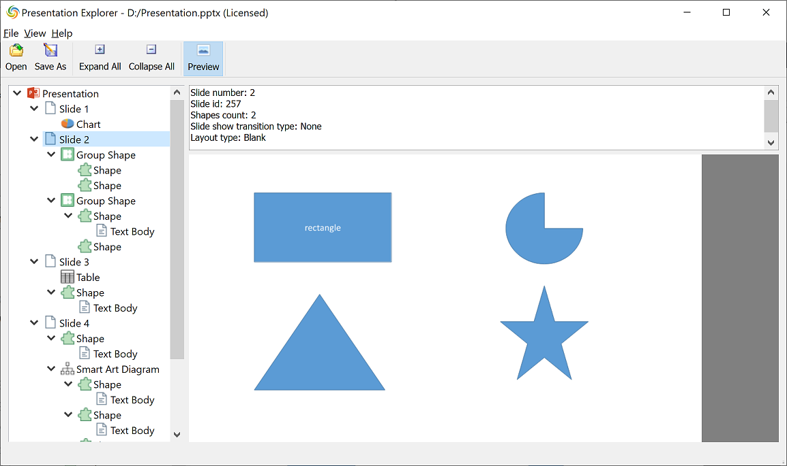
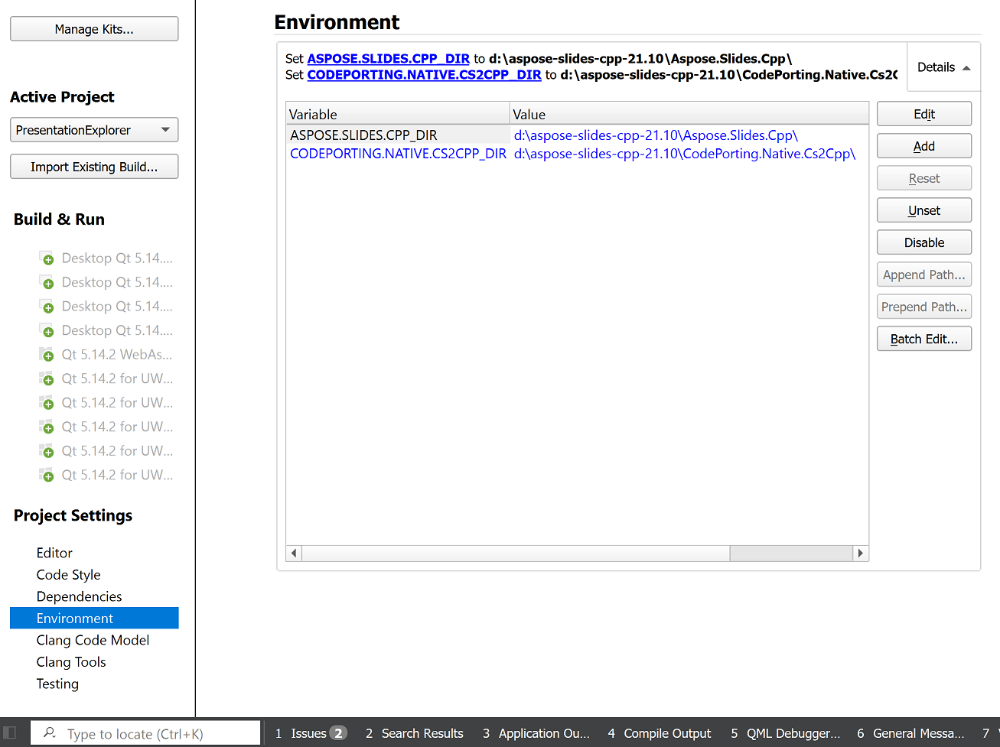
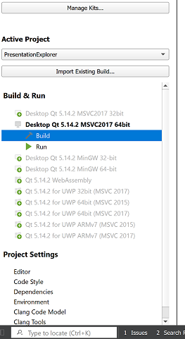
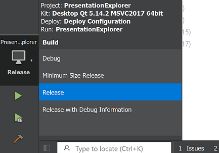

# PresentationExplorer Demo

PresentationExplorer allows to open presentations using **Aspose.Slides for C++**.
Once a presentation is opened, you can explore its object model in the tree.
You can also save the document into PPT, PPTX, ODP, FODP, PDF, TIFF, GIF, XPS, HTML formats.



## How to build PresentationExplorer

To build PresentationExplorer on your computer you will need these packages:
- Qt5 or Qt6 (https://www.qt.io/)
- CMake 3.5+ (https://cmake.org/)
- Aspose.Slides for C++ (https://downloads.aspose.com/slides/cpp)

### Build using Visual Studio 2019

1) Generate Visual Studio solution:
   ```bat
   cmake -G "Visual Studio 16 2019" -Ax64 -B build -DQT_DIR=<path> -DCodePorting.Native.Cs2Cpp_DIR=<path> -DAspose.Slides.Cpp_DIR=<path>
   ```

   The following parameters must be specified:
   - `QT_DIR` - path to the directory which contains `Qt5Config.cmake` (or `Qt6Config.cmake`).
   - `CodePorting.Native.Cs2Cpp_DIR` - path to the directory which contains `codeporting.native.cs2cpp-config.cmake`.
   - `Aspose.Slides.Cpp_DIR` - path to the directory which contains `aspose.slides.cpp-config.cmake`.

   For example:
   ```bat
   cmake -G "Visual Studio 16 2019" -Ax64 -B build -DQT_DIR=C:\Qt\5.15.2\msvc2019_64\lib\cmake\Qt5 -DCodePorting.Native.Cs2Cpp_DIR=d:\aspose-slides-cpp-21.10\CodePorting.Native.Cs2Cpp -DAspose.Slides.Cpp_DIR=d:\aspose-slides-cpp-21.10\Aspose.Slides.Cpp\
   ```

   An alternative is to use a `CMAKE_PREFIX_PATH` variable:
   ```bat
   cmake -G "Visual Studio 16 2019" -Ax64 -B build -DCMAKE_PREFIX_PATH=d:\Qt\5.15.2\msvc2019_64\lib\cmake;d:\aspose-slides-cpp-21.10
   ```
2) Build Visual Studio solution
   ```bat
   cmake --build build --config Release
   ```

   You can open soluton with the following command:
   ```bat
   cmake --open build
   ```

### Build using Qt Creator

1) Open Qt Creator.

2) Select **File > Open File or Project...** and specify the location of the PresentationExplorer `CMakeLists.txt`.

3) Select **Project Settings > Environment** and specify variables:
   - `CodePorting.Native.Cs2Cpp_DIR` - path to the directory which contains `codeporting.native.cs2cpp-config.cmake`.
   - `Aspose.Slides.Cpp_DIR` - path to the directory which contains `aspose.slides.cpp-config.cmake`.

   

4) Select **Build & Run** and specify the kit you need.



5) Select "Release" configuration and run the application using the panel.


